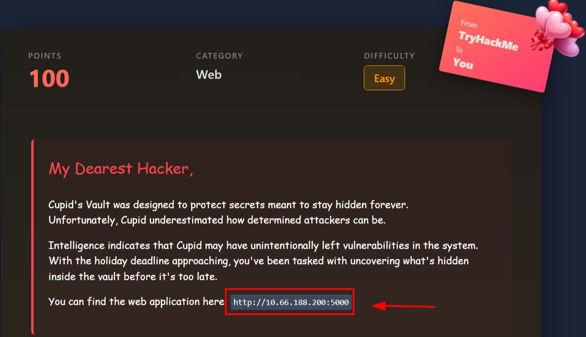
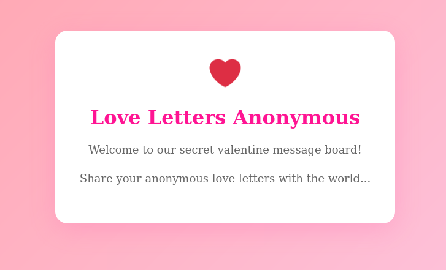
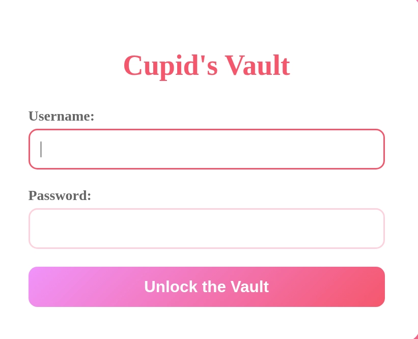

# Hidden Deep Into my Heart

# Scenario



# Solution

Access : [http://10.66.188.200:5000/](http://10.66.188.200:5000/) , appears like a normal site 



Let’s check `/robots.txt` 


Let’s dig more and access at `/cupids_secret_vault/`


Let’s enumerate if there is hidden directories !!

```bash
sudo dirsearch -u http://10.66.188.200:5000/cupids_secret_vault

[14:39:52] 200 -    2KB - /cupids_secret_vault/administrator
```

We found `/cupids_secret_vault/administrator` accessible so let’s try that, probably that’s gonna be our login page



at `/robots.txt` remember we found a comment that could be probably the password , and the username let’s try something like `admin`  

→ **Login Creds :** `admin:cupid_arrow_2026!!!`


There you go we found our flag!! , try it for yourself , of course im not gonna show you the flag 😊
