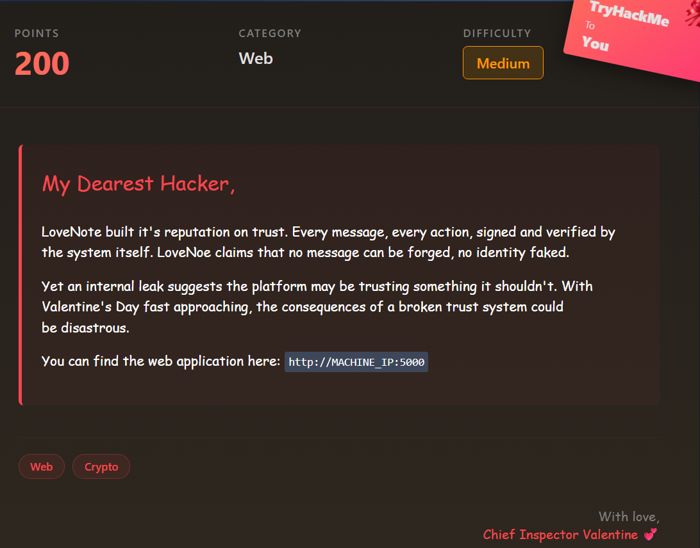

# Signed Messages

# Scenario



---

# Solution

[http://signed.thm:5000/](http://signed.thm:5000/)


## Directory Enumeration

```bash
$ sudo dirsearch -u http://signed.thm:5000/ 

[10:05:52] 200 -   15KB - /about                                            
[10:07:39] 302 -  218B  - /dashboard  ->  http://signed.thm:5000/login      
[10:07:41] 200 -   11KB - /debug                                            
[10:08:10] 200 -   11KB - /login                                            
[10:08:12] 302 -  208B  - /logout  ->  http://signed.thm:5000/              
[10:08:17] 200 -   13KB - /messages                                         
[10:08:42] 200 -   12KB - /register
```

At `/debug` we found this :

```bash
System Debug Logs

[2026-02-06 14:23:15] Development mode: ENABLED

[2026-02-06 14:23:15] Using deterministic key generation
[2026-02-06 14:23:15] Seed pattern: {username}_lovenote_2026_valentine

[DEBUG] Seed converted to bytes for cryptographic processing
[DEBUG] Seed hashed using SHA256 to produce large numeric material

[DEBUG] Prime derivation step 1:
[DEBUG] Converting SHA256(seed) into a large integer
[DEBUG] Checking consecutive integers until a valid prime is reached
[DEBUG] Prime p selected

[DEBUG] Prime derivation step 2:
[DEBUG] Modifying seed with PKI-related constant (SHA256(seed + b"pki"))
[DEBUG] Hashing modified seed with SHA256
[DEBUG] Converting hash into a large integer
[DEBUG] Checking consecutive integers until a valid prime is reached
[DEBUG] Prime q selected

[2026-02-06 14:23:16] RSA modulus generated from p × q
[2026-02-06 14:23:16] RSA-2048 key pair successfully constructed
[2026-02-06 14:23:17] Public and private keys saved to disk
```

The `/verify` is the most important one cuz there we verify the admin signature , and after a long chatgpt conversation i found this code working to give the right `admin_signature`

```python
import hashlib
from sympy import nextprime
from Crypto.PublicKey import RSA
from Crypto.Signature import pss
from Crypto.Hash import SHA256
from Crypto.Util.number import inverse

TARGET_USER = "admin"
TARGET_MESSAGE = "Hello"

def generate_admin_key():
    print(f"[*] Generating deterministic 512-bit key for: {TARGET_USER}")

    # Deterministic seed
    seed_str = f"{TARGET_USER}_lovenote_2026_valentine"
    seed_bytes = seed_str.encode()

    # Generate p
    sha256_p = hashlib.sha256(seed_bytes).hexdigest()
    p = nextprime(int(sha256_p, 16))

    # Generate q
    sha256_q = hashlib.sha256(seed_bytes + b"pki").hexdigest()
    q = nextprime(int(sha256_q, 16))

    n = p * q
    e = 65537
    phi = (p - 1) * (q - 1)
    d = inverse(e, phi)

    key = RSA.construct((n, e, d, p, q))

    modBits = key.size_in_bits()
    h = SHA256.new(TARGET_MESSAGE.encode())

    emLen = (modBits - 1 + 7) // 8
    maxSalt = emLen - h.digest_size - 2

    print(f"[*] Key size: {modBits} bits")
    print(f"[*] EM Length: {emLen} bytes")
    print(f"[*] Calculated Max Salt: {maxSalt} bytes")

    if maxSalt < 0:
        raise ValueError("Key too small for PSS padding.")

    signer = pss.new(key, salt_bytes=maxSalt)
    signature = signer.sign(h)

    return signature.hex()

if __name__ == "__main__":
    try:
        signature = generate_admin_key()

        print("\n" + "="*60)
        print(" >>> FINAL ZEUS SIGNATURE <<< ")
        print("="*60)
        print(signature)
        print("="*60)
        print("1. Go to Verify page.")
        print("2. User: zeus")

    except Exception as e:
        print(f"[!] Error: {e}")
```

Execute the code !!


Now if you go to `/verify` — user : admin and copy paste that **signature** with the message `“Hello”` .

You’ll get the flag right away it was really hard, took me a lot to find a valid signature but it was worth it in the end !!


Copy paste the flag and you’re done 😊 !!
