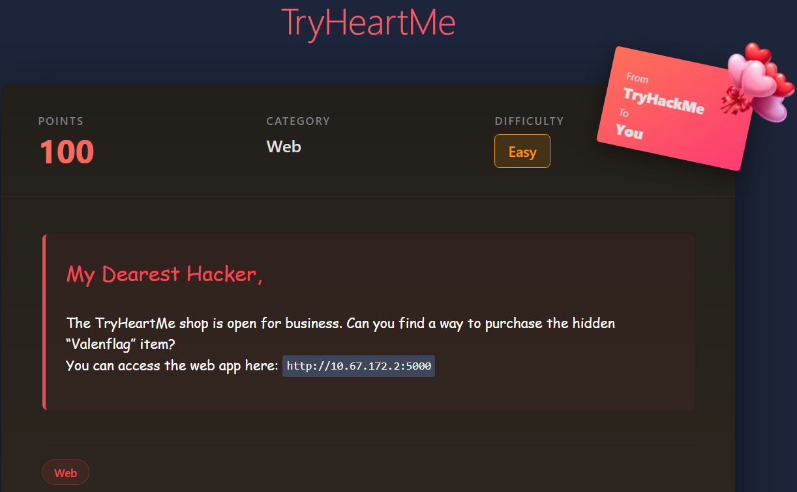

# TryHeartMe

# Scenario



# Solution

Check the website


It’s a shop , Let’s register as test user with creds — `test@thm.com:testtest` 

Once registered inspect the cookies with `F12` muscle 


---

## JWT Token ?

- **JWT** is a **token** that contains a small amount of **user-related information**, like your **user ID** or **role** (e.g., admin, user).
- It’s usually sent from a **server** to a **client** (browser or app) after logging in or performing some action, and the client can use this token for **subsequent requests** without having to log in again.
- It’s **self-contained** — all the information the server needs is inside the token itself, so the server doesn’t have to look up the user in a database every time.

---

Let’s get back to it i have a site for you to help decode the token — [https://www.jwt.io/](https://www.jwt.io/)


Then hit `JWT Encoder` and modify the payload

```bash
{
  "email": "test@thm.com",
  "role": "user",
  "credits": 0,
  "iat": 1771275268,
  "theme": "valentine"
}
```

We’re gonna simply change `role → admin` and `credits → 9999` 

```bash
{
  "email": "test@thm.com",
  "role": "admin",
  "credits": 9999,
  "iat": 1771275268,
  "theme": "valentine"
}
```


Paste the new **JWT token** in here 


Then simply refresh the page


Boom a new item that looks like our flag , and most importantly we became admin , let’s buy the new item we have `credits = 9999` 


And you’re Finished 😊
