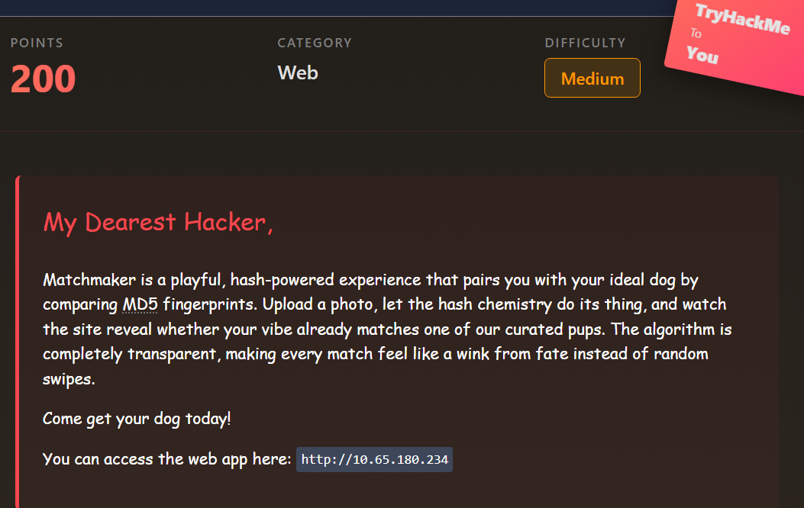

# When Hearts Collide

# Scenario



# Website Discovery


Nothing special in the source code !!

if we upload any image to check the website behaviour when we upload a random photo


No match , Let’s try looking for an **md5 collision generator** maybe

# Solution

**Tool :** https://github.com/brimstone/fastcoll

Install the tool :

```bash
$ docker pull brimstone/fastcoll
```

Then to create a **clone** to `dog.jpg` :

```bash
$ docker run --rm -it -v $PWD:/work -w /work \
brimstone/fastcoll \
--prefixfile dog.jpg \
-o new1.jpg new2.jpg

MD5 collision generator v1.5
by Marc Stevens (http://www.win.tue.nl/hashclash/)

Using output filenames: 'new1.jpg' and 'new2.jpg'
Using prefixfile: 'dog.jpg'
Using initial value: d952c4dc451491468eae61789055c54a

Generating first block: ......................
Generating second block: S10...........................
Running time: 5.73991 s
```

If we check md5 hashes they match !!


Upload `new2.jpg` for example and check if we get the flag 😊


That’s your flag congrats !! , try it for yourself 😊
